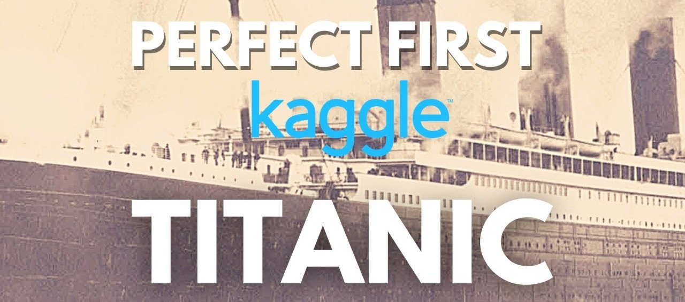

# Desafio do Titanic - Kaggle

Este é o meu repositório para o Desafio do Titanic no Kaggle. O desafio é baseado em um conjunto de dados de passageiros do RMS Titanic e o objetivo é prever quem sobreviveu e quem não sobreviveu ao desastre com base em várias características dos passageiros.

Este projeto foi criado como parte de um aprendizado de máquina e ciência de dados e busca aprimorar minhas habilidades em análise de dados, pré-processamento, modelagem e avaliação de modelos de aprendizado de máquina.

## Estrutura do Repositório

- **notebooks**: Esta pasta contém os notebooks Jupyter usados para explorar e modelar os dados.

- **data**: Aqui você encontrará os conjuntos de dados de treinamento e teste fornecidos pelo Kaggle.

- **scripts**: Qualquer script Python relacionado ao projeto que não esteja em um notebook pode ser encontrado aqui.

- **resultados**: Este diretório armazena os resultados e modelos treinados.

## Licença
Este projeto é licenciado sob a Licença MIT - consulte o arquivo LICENSE para obter detalhes.

Agradeço por conferir este repositório e estou ansioso para suas contribuições e sugestões! Se você tiver alguma dúvida ou quiser discutir mais sobre o projeto, sinta-se à vontade para entrar em contato comigo.